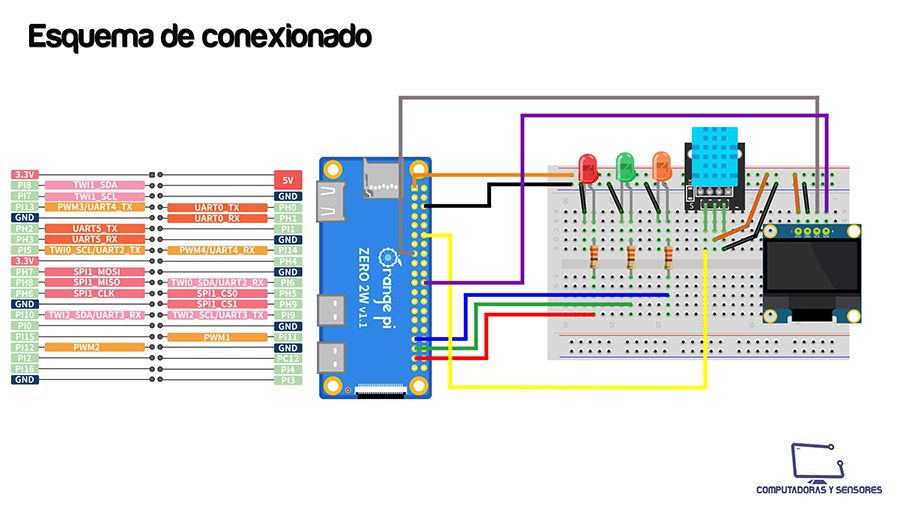

# Orange Pi Zero 2W uso de GPIO

Códigos en Python para encender 3 LEDs utilizando los GPIOs 25,23 y 22. También una variante del código desarrollado por Orange Pi en el que se muestra en una pantalla OLED SSD1306 el IP de la red local a la cual está conectada la placa, el horario y el empleo del CPU en porcentaje.

# Paso a paso

La explicación completa la podrás ver en el siguiente video de Youtube:
https://youtu.be/0f1oAuXHL3A

